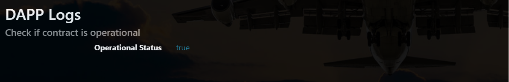

# FlightSurety

FlightSurety is a sample application project for Udacity's Blockchain course.

## Install

This repository contains Smart Contract code in Solidity (using Truffle), tests (also using Truffle), dApp scaffolding (using HTML, CSS and JS) and server app scaffolding.

To install, download or clone the repo, then:

`npm install`
`truffle compile`

## Develop Client

To run truffle tests:

`truffle test ./test/flightSurety.js`
`truffle test ./test/oracles.js`

To use the dapp:

`truffle migrate`
`npm run dapp`

To view dapp:

`http://localhost:8000`

## Develop Server

`npm run server`
`truffle test ./test/oracles.js`

## Deploy

To build dapp for prod:
`npm run dapp:prod`

Deploy the contents of the ./dapp folder

## Navigation through the DAPP

The page is divided in different sections:
* DAPP Logs
* Airline actions
* Flight actions
* Oracle actions
* Passenger actions

Every time an action is performed, a log will be displayed at the top "Dapp Logs" section. 

### The basic steps to navigate and use the DAPP are the following:

1) Once the DAPP is run, the state of the contract( operational or not) is displayed in Logs.

2) The user comes to the Airlines Actions section for registering and funding airlines

3) Next the user adds funds of 10 ether to the first airline registered by default 

4) The user registers three more airlines from the first airline and funds them.

   
5) User selects a flight from pre-filled list of flight codes and registers one or more flight. 
Each flight registered with default status code 'Unknown' shows up in Logs.
This also populates the list of registered flights in Oracle Actions section below.

6) The user can pays insurance premium of 1 ether from the selected passenger address.

7) In the Oracles Action section once flight status is asked for a flight, oracles are triggered.
The updated flight status for the flight from selected oracles is displayed in Logs.

8) For flights with status of "Late Airline", the passenger can claim insurance in the Passengers Action section.
The amount of insurance in ether the passenger is eligible to withdraw shows in Logs.

9) Finally the insurance amount can be withdrawn to the passenger's account.

## Resources

* [How does Ethereum work anyway?](https://medium.com/@preethikasireddy/how-does-ethereum-work-anyway-22d1df506369)
* [BIP39 Mnemonic Generator](https://iancoleman.io/bip39/)
* [Truffle Framework](http://truffleframework.com/)
* [Ganache Local Blockchain](http://truffleframework.com/ganache/)
* [Remix Solidity IDE](https://remix.ethereum.org/)
* [Solidity Language Reference](http://solidity.readthedocs.io/en/v0.4.24/)
* [Ethereum Blockchain Explorer](https://etherscan.io/)
* [Web3Js Reference](https://github.com/ethereum/wiki/wiki/JavaScript-API)

# Program version numbers

* Node.js v10.16.0
* Solidity v^0.4.24
* Truffle v5.1.53
* truffle-hdwallet-provider v1.0.2
* Web3 v1.0.0-beta.37
